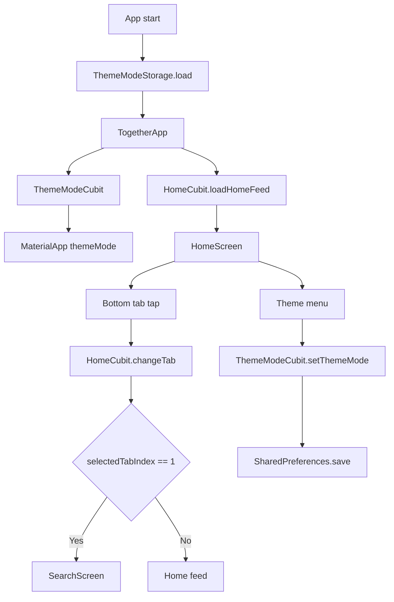

# Together App

Flutter demo app mo phong giao dien social feed kieu Threads, hien co 2 luong chinh la `Home feed` va `Search`, kem theo chuyen theme sang `System/Light/Dark`.

## Yeu cau moi truong

- Flutter SDK 3.x
- Dart SDK 3.x
- Thiet bi gia lap hoac trinh duyet de chay Flutter

## Huong dan setup theo quy trinh B1-B3

### B1: Cai dat FVM

- Cai Flutter version bang FVM:

```bash
fvm install 3.41.2
```

- Them vao file `.vscode/settings.json`:

```json
{
   "dart.flutterSdkPath": ".fvm/versions/3.41.2"
}
```

### B2: Tao file `.env`

Them noi dung sau vao file `.env` o thu muc goc du an:

```env
API_URL = 'https://digital-business-card-api.com'
APP_STORE_ID = '5245641223'
```

### B3: Chay lenh generate

Chay lan luot cac lenh sau:

```bash
fvm flutter clean
fvm flutter pub get
fvm dart run intl_utils:generate
fvm dart run build_runner build --delete-conflicting-outputs
```

## Cai dat va chay

```bash
flutter pub get
flutter run
```

## Kien truc hien tai

- `lib/main.dart`: diem vao app, khoi tao `ThemeModeStorage`, `ThemeModeCubit`, `HomeCubit`
- `lib/features/home/presentation/screen/home_screen.dart`: man hinh goc, dieu phoi feed, search tab, theme menu, bottom tab bar
- `lib/features/home/presentation/cubits/home_cubit.dart`: nguon state cho feed va tab duoc chon
- `lib/features/search/presentation/screen/search_screen.dart`: giao dien search mock data
- `lib/core/theme/*`: theme light/dark va co che luu theme vao `SharedPreferences`

## So do luong chinh



## Phan tich cac luong hoat dong

### 1. Luong khoi dong app

1. `main()` goi `WidgetsFlutterBinding.ensureInitialized()`.
2. `ThemeModeStorage.load()` doc theme da luu tu `SharedPreferences`.
3. `TogetherApp` duoc mount voi `ThemeModeCubit` va `HomeCubit`.
4. `HomeCubit` tu dong goi `loadHomeFeed()` trong constructor de nap danh sach bai viet mock.
5. `MaterialApp` render `HomeScreen` voi `theme`, `darkTheme` va `themeMode` hien tai.

Ket qua: app luon vao `HomeScreen`, dong thoi giu duoc theme da chon tu lan mo truoc.

### 2. Luong hien thi Home feed

1. `HomeScreen` lang nghe `HomeCubit` qua `BlocBuilder<HomeCubit, HomeState>`.
2. Khi `selectedTabIndex != 1`, man hinh hien `HomeHeader` + `ListView.separated` cac `ThreadPostCard`.
3. Du lieu bai viet den tu `HomeState.posts`, hien dang la mock data hard-code trong `HomeCubit`.
4. Moi post co the hien noi dung text, anh, verified badge, comment thread va action row tuy theo du lieu.

Ghi chu:

- Feed hien tai khong goi API; toan bo du lieu duoc tao san trong state.
- `primaryMeta`, `secondaryMeta`, `threadStackAsset` dang co trong model nhung chua duoc render len UI.

### 3. Luong scroll trong Home feed

1. `HomeScreen` gan `ScrollController` vao feed list.
2. Khi nguoi dung scroll xuong vuot nguong `8.0`, app:
   - thu gon `HomeHeader`
   - an `HomeBottomTabBar`
3. Khi scroll nguoc len vuot nguong `8.0`, app:
   - mo rong lai header
   - hien lai bottom bar

Muc tieu cua luong nay la tang khong gian doc noi dung khi nguoi dung dang xem feed.

### 4. Luong chuyen tab duoi cung

1. Nguoi dung tap icon trong `HomeBottomTabBar`.
2. `onTap` goi `HomeCubit.changeTab(index)`.
3. `HomeState.selectedTabIndex` duoc cap nhat, UI rebuild.
4. Neu index = `1`, `HomeScreen` render `SearchScreen`.
5. Neu index khac `1`, app quay ve giao dien Home feed.

Ghi chu quan trong:

- Hien tai chi co `Search` la co man hinh rieng.
- Cac tab `Home`, `Write`, `Activity`, `Profile` chua co flow rieng; app chi doi icon selected va van dung chung giao dien Home.

### 5. Luong Search

1. Khi tab `Search` duoc chon, `HomeScreen` thay phan body bang `SearchScreen`.
2. `SearchScreen` render:
   - tieu de `Search`
   - o search dang mock UI
   - danh sach account goi y tu `_accounts`
3. Moi item duoc ve boi `SearchAccountTile`, gom avatar fallback, verified icon, subtitle, follower count va nut `Follow`.

Trang thai hien tai:

- O search chua nhap du lieu, chua filter danh sach.
- Nut `Follow` chua gan su kien tap.
- Danh sach account la static mock data.

### 6. Luong doi theme

1. Nguoi dung tap menu theme o goc phai tren `HomeScreen`.
2. Chon `System`, `Light` hoac `Dark` trong `PopupMenuButton`.
3. `ThemeModeCubit.setThemeMode()` emit state moi.
4. `MaterialApp` rebuild voi `themeMode` moi.
5. Theme vua chon duoc luu lai qua `ThemeModeStorage.save()` vao `SharedPreferences`.

Tac dong:

- Mau nen, text, divider va cac token cua Search/Home doi theo theme.
- Tab dang chon duoc giu nguyen khi doi theme.

### 7. Luong tuong tac trong bai viet

1. Moi `ThreadPostCard` co hang action gom like, reply, repost, send.
2. Action like su dung widget state cuc bo (`_ActionWithCountState`) de:
   - doi icon tim thuong/tim do
   - tang giam so dem
   - animate chu so cuoi khi count thay doi
3. Cac action khac hien tai chi hien thi icon va count, chua co hanh vi.

Luu y:

- Trang thai like hien tai khong luu vao `Cubit`, khong dong bo toan app va se mat khi widget rebuild manh.
- Day la local interaction phu hop cho UI demo, chua phai business flow hoan chinh.

## Test hien co

```bash
flutter test
```

Bo test dang cover cac hanh vi chinh sau:

- `test/theme_mode_storage_test.dart`: doc/ghi theme mode vao `SharedPreferences`
- `test/dark_mode_widgets_test.dart`: kiem tra dark mode, search screen, home screen va viec doi theme khong lam mat tab dang chon

## Gioi han hien tai

- Du lieu feed va search deu la mock data hard-code
- Chua co backend, auth, API, routing da man hinh hay persistence ngoai theme mode
- Search, follow, reply, repost, send va cac tab ngoai `Search` chua co xu ly nghiep vu
- `lib/features/home/presentation/widget/thread_post_card.dart` dang kha lon va gom ca UI + local interaction state

## Huong mo rong hop ly

1. Tach flow cho `Write`, `Activity`, `Profile` thanh man hinh rieng
2. Dua feed/search sang repository + API layer thay vi hard-code trong `Cubit`
3. Chuyen cac tuong tac nhu like/follow sang state management chung de de mo rong
4. Tach nho `thread_post_card.dart` de giam do phuc tap va de test hon
